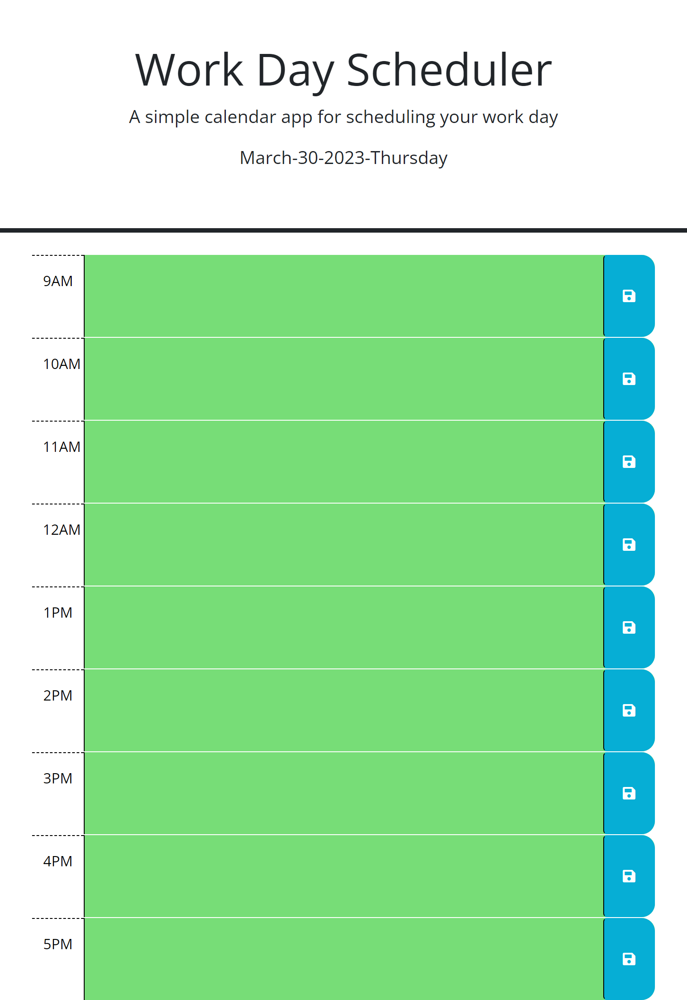

# Work Day Scheduler

## User Story
#### *As an employee with a busy schedule, I want to add important events to a daily planner, so that I can manage my time effectively.*

 

----

## Description
* Added description to locale storage to pull description of user from (input.value).

* Color scheme changes according to past, present, and future.

* Added header using dayjs to display current date.

* Work Day Scheduler time-frame from 9AM to 5PM using 24-hour clock.

 

----

### **Link to deployed application**

*Added link for deployed application from github.com*

* [Work Day Scheduler](https://sithhun.github.io/hw5-workdayscheduler/)

 

----
## Screenshot

